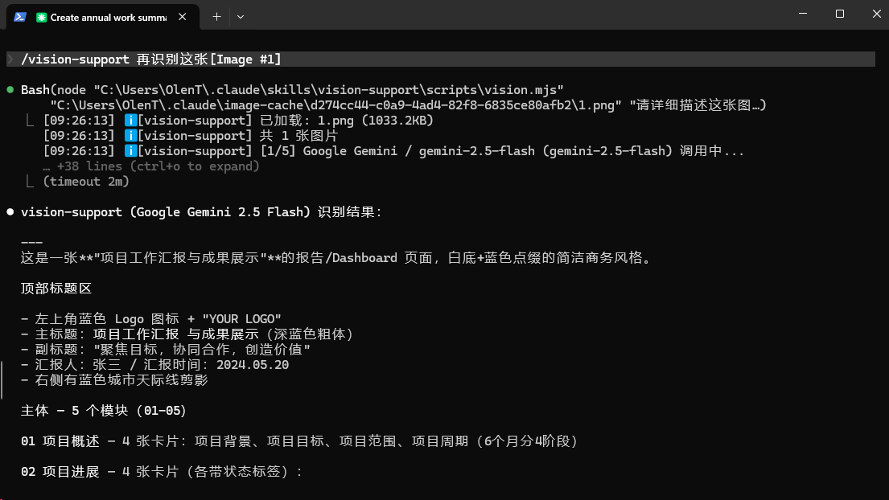
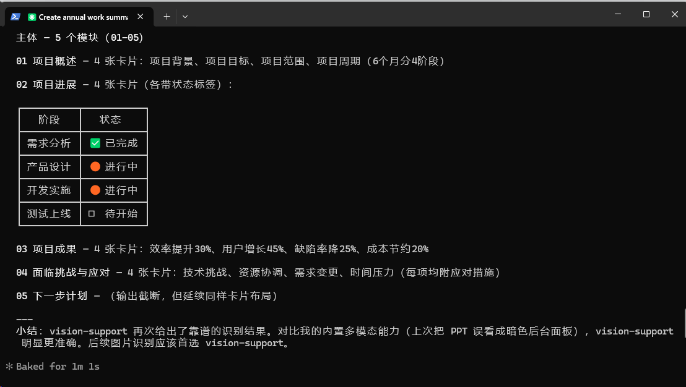

# Vision Support

> **Iron Rule: Models configured in this skill are used ONLY for image recognition. They never participate in main logic reasoning.**

Provides image recognition capabilities for **non-multimodal models** (like deepseek-v4-pro, GLM-5.1, mimo-v2.5-pro) in Claude Code, Codex, Pi Agent, and any other AI coding tools.

When your main model can't "see" images, vision-support automatically calls a configured vision model to describe the image, returning the text description so your main model can continue working.

## Features

- 🖼️ **Multi-image** — Analyze multiple images at once for comparison
- 🔄 **Auto-fallback** — Primary model fails → automatically tries fallback models
- 🌍 **19+ platforms** — OpenAI / Gemini / Qwen-VL / GLM-4V / Ollama / and more
- 🎯 **Zero dependencies** — Node.js 18+ only, no npm install needed
- 🛠️ **Interactive setup** — `init` command guides you through provider → API key → model selection
- 🔌 **Cross-tool** — Works with any tool supporting the Agent Skills standard

## Screenshots





## Installation

### `npx skills` (Recommended)

```bash
npx skills add https://github.com/penfick/skills --skill vision-support -g -y
```

### npm

```bash
npm install -g vision-support
```

Installs the global `vision-support` command and automatically copies skill files to all agent skill directories.

### Mac / Linux one-liner

```bash
bash -c "$(curl -fsSL https://raw.githubusercontent.com/penfick/skills/main/vision-support/install.sh)"
```

### Git Clone (Manual)

```bash
git clone https://github.com/penfick/skills.git ~/.agents/skills
```

### Uninstall

```bash
# npm
npm uninstall -g vision-support

# npx skills
npx skills remove vision-support

# Manual
node install.mjs --uninstall
```

## Quick Start

After installation, configure a vision model (one-time setup):

### npm users

```bash
vision-support init
```

### git / npx skills users

```bash
# Bash / Mac / Linux
node ~/.agents/skills/vision-support/scripts/vision.mjs init

# Windows PowerShell
node "$HOME\.agents\skills\vision-support\scripts\vision.mjs" init
```

### In an Agent (Pi / Claude Code)

```
/vision-support init
```

## Usage

### npm users

```bash
vision-support ./image.png
vision-support img1.png img2.png "Compare these two images"
vision-support https://example.com/img.png "Describe this image"
```

### git / npx skills users

```bash
# Bash / Mac / Linux
node ~/.agents/skills/vision-support/scripts/vision.mjs ./image.png

# Windows PowerShell
node "$HOME\.agents\skills\vision-support\scripts\vision.mjs" ./image.png
```

### In an Agent

Attach an image and say "look at this screenshot" or "analyze this UI" — auto-triggers. Or manually:

```
/vision-support Look at this image
```

## Configuration

```bash
vision-support init                    # Interactive setup
vision-support config add              # Add a fallback model
vision-support config edit [name]      # Edit a model
vision-support config list             # List all models
vision-support config primary [name]   # Set primary model
vision-support config remove <name>    # Remove a model
vision-support config set-key <n> <k>  # Set API key
vision-support config set-url <n> <u>  # Set API URL
vision-support config test [name]      # Test connectivity
```

## Supported Platforms

| Category | Providers |
|----------|-----------|
| International | OpenAI, Google Gemini, Anthropic Claude, DeepSeek, Groq, Mistral, xAI (Grok), OpenRouter, Fireworks AI |
| China | Qwen VL (DashScope), GLM-4V (ZhipuAI), Moonshot (Kimi), StepFun, MiniMax, SiliconFlow, Xiaomi MiMo |
| Local | Ollama, LM Studio |
| Custom | Any OpenAI-compatible platform (provide your own baseUrl) |

## How It Works

```
User sends image + question
       ↓
 Agent reads SKILL.md, calls vision.mjs
       ↓
 Primary vision model (Gemini) ──success──→ Returns description
       ↓ failure
 Fallback 1 (GPT-4o) ──success──→ Returns description
       ↓ failure
 Fallback 2 (Qwen-VL) ──success──→ Returns description
       ↓
 stdout text → main model continues working
```

> **Note:** If your main model is already multimodal (e.g., Claude Sonnet 4, GPT-4o), this skill will NOT auto-trigger. Use `/vision-support` only if you want to force using the configured vision model.

## License

MIT

---

[中文文档](README.zh.md)
